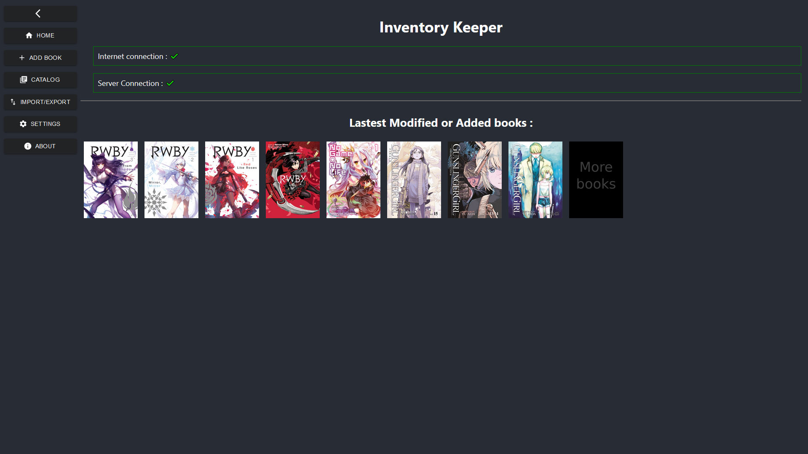
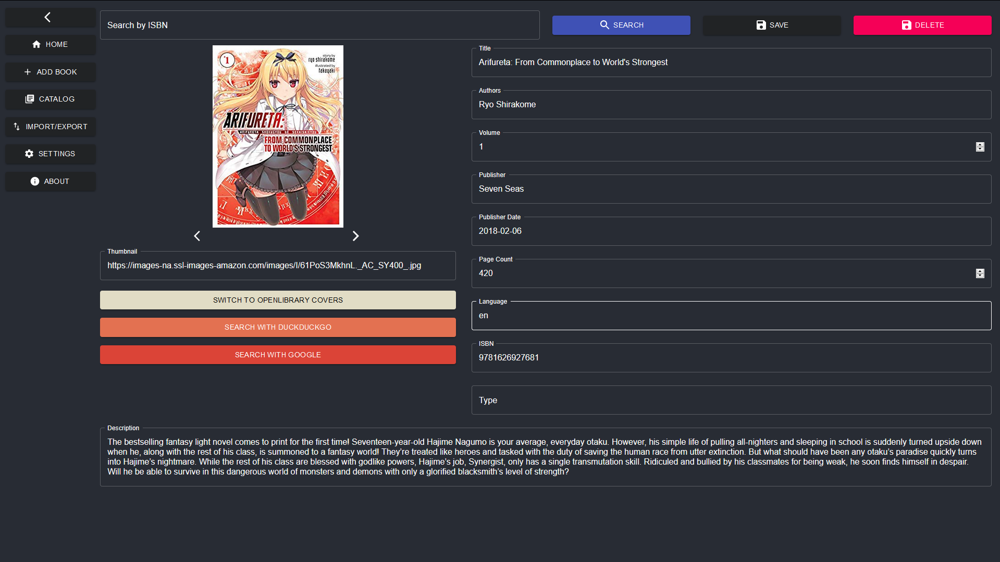

# Screenshots

## Android App

### Homepage

### Catalog

### Adding a book - Scan

### Adding a book - Scan - Multiple Choice

### Adding a book - Manual

### Seeing a book info

### Export/Import

### Drawer

## Webpage

### Homepage

### Catalog

### Adding a book

### Seeing a book info

### Export/Import

### Settings
